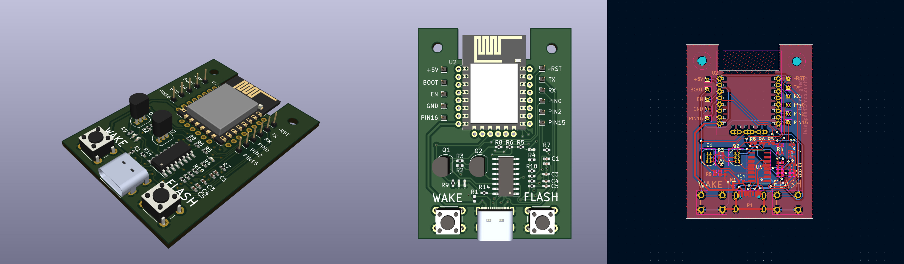
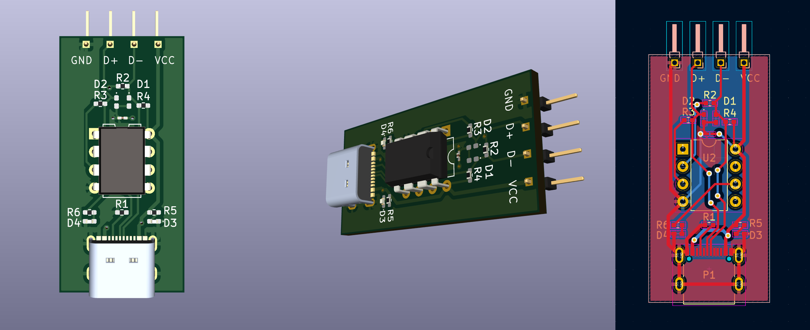

# Collection of Kicad Projects

[cc-by-nc-sa]: http://creativecommons.org/licenses/by-nc-sa/4.0/
[cc-by-nc-sa-image]: https://licensebuttons.net/l/by-nc-sa/4.0/88x31.png
[cc-by-nc-sa-shield]: https://img.shields.io/badge/License-CC%20BY--NC--SA%204.0-lightgrey.svg

[![CC BY-NC-SA 4.0][cc-by-nc-sa-shield]][cc-by-nc-sa]

This is a collection of Kicad projects that I have created.  I am sharing them in the hope that they will be useful to others. Bom list in [https://zhenglinlei.github.io/pcb-project-kicad/](https://zhenglinlei.github.io/pcb-project-kicad/)

## Schema
The schema files are in the `schema` directory.  They are in the Kicad format.

## PCB
The PCB files are in the `gerber` directory.  Can be viewed with [gerbv](http://gerbv.geda-project.org/). To fabricate the PCBs, zip the contents of the `gerber` directory and upload to your favorite PCB manufacturer.

## Images

## License
All of the projects are licensed under the [Creative Commons Attribution-ShareAlike 4.0 International License](http://creativecommons.org/licenses/by-sa/4.0/).
